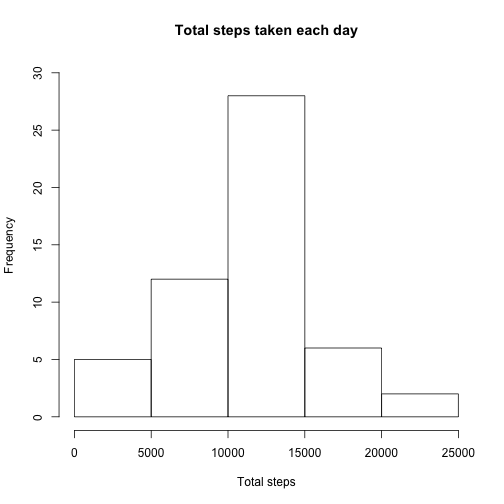
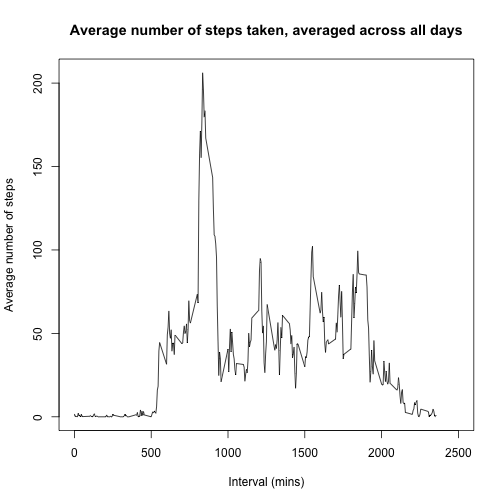
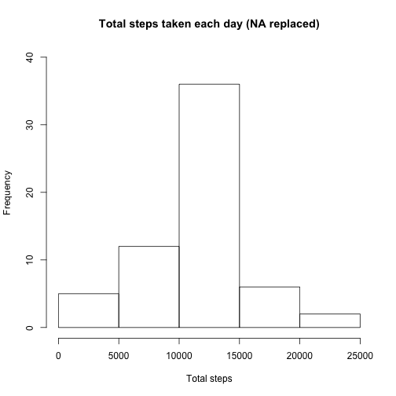
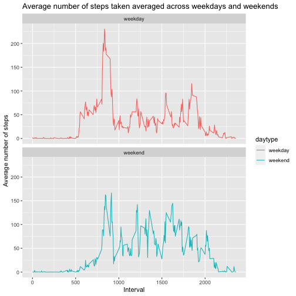

# Reproducible Research Course Project 1

## Loading and preprocessing the data
1. Load the data  

```r
filename <- "activity.zip"
if(!file.exists("activity.csv")) 
        unzip(filename)
activity <- read.csv("activity.csv")
```

2. Process/transform the data (if necessary) into a format suitable for your analysis

```r
str(activity) 
```

```
## 'data.frame':	17568 obs. of  3 variables:
##  $ steps   : int  NA NA NA NA NA NA NA NA NA NA ...
##  $ date    : Factor w/ 61 levels "2012-10-01","2012-10-02",..: 1 1 1 1 1 1 1 1 1 1 ...
##  $ interval: int  0 5 10 15 20 25 30 35 40 45 ...
```

```r
summary(activity)
```

```
##      steps                date          interval     
##  Min.   :  0.00   2012-10-01:  288   Min.   :   0.0  
##  1st Qu.:  0.00   2012-10-02:  288   1st Qu.: 588.8  
##  Median :  0.00   2012-10-03:  288   Median :1177.5  
##  Mean   : 37.38   2012-10-04:  288   Mean   :1177.5  
##  3rd Qu.: 12.00   2012-10-05:  288   3rd Qu.:1766.2  
##  Max.   :806.00   2012-10-06:  288   Max.   :2355.0  
##  NA's   :2304     (Other)   :15840
```

```r
# I am not going to make any changes to the dataset yet. Will convert dates to date format at a later point.
```

## What is mean total number of steps taken per day?
1. Calculate the total number of steps taken per day  

```r
total_steps <- aggregate(steps~date, activity, sum, na.rm = TRUE)
colnames(total_steps) <- c("date", "steps")
head(total_steps) # Take a look to make sure variables are set correctly
```

```
##         date steps
## 1 2012-10-02   126
## 2 2012-10-03 11352
## 3 2012-10-04 12116
## 4 2012-10-05 13294
## 5 2012-10-06 15420
## 6 2012-10-07 11015
```

2. Make a histogram of the total number of steps taken each day  

```r
hist(total_steps$steps, xlab = "Total steps", main = "Total steps taken each day", ylim = c(0,30))
```



3. Calculate and report the mean and median of the total number of steps taken per day  

```r
mean(total_steps$steps)
```

```
## [1] 10766.19
```

```r
median(total_steps$steps)
```

```
## [1] 10765
```
## What is the average daily activity pattern?

1. Make a time series plot of the 5-minute interval (x-axis) and the average number of steps taken, averaged across all days (y-axis)  

```r
interval_steps <- aggregate(steps~interval, activity, mean, na.rm = TRUE)
colnames(interval_steps) <- c("interval", "steps")
summary(interval_steps) # Check max point for each axis to adjust x- and y-limits
```

```
##     interval          steps        
##  Min.   :   0.0   Min.   :  0.000  
##  1st Qu.: 588.8   1st Qu.:  2.486  
##  Median :1177.5   Median : 34.113  
##  Mean   :1177.5   Mean   : 37.383  
##  3rd Qu.:1766.2   3rd Qu.: 52.835  
##  Max.   :2355.0   Max.   :206.170
```

```r
with(interval_steps, plot(interval, steps, type = "l", xlab = "Interval (mins)", ylab = "Average number of steps", main = "Average number of steps taken, averaged across all days", xlim = c(0, 2500)))
```



2. Which 5-minute interval, on average across all the days in the dataset, contains the maximum number of steps?  

```r
interval_steps[which.max(interval_steps$steps), ]$interval
```

```
## [1] 835
```

## Imputing missing values

1. Calculate and report the total number of missing values in the dataset  

```r
sapply(activity, function(x) sum(is.na(x)))
```

```
##    steps     date interval 
##     2304        0        0
```

2. Devise a strategy for filling in all of the missing values in the dataset. The strategy does not need to be sophisticated. For example, you could use the mean/median for that day, or the mean for that 5-minute interval, etc.  

```r
activity$steps_full <- ifelse(is.na(activity$steps), interval_steps$steps[match(activity$interval, interval_steps$interval)], activity$steps) # Replaced missing values with the mean of the 5-minute interval 
head(activity)
```

```
##   steps       date interval steps_full
## 1    NA 2012-10-01        0  1.7169811
## 2    NA 2012-10-01        5  0.3396226
## 3    NA 2012-10-01       10  0.1320755
## 4    NA 2012-10-01       15  0.1509434
## 5    NA 2012-10-01       20  0.0754717
## 6    NA 2012-10-01       25  2.0943396
```

3. Create a new dataset that is equal to the original dataset but with the missing data filled in. 

```r
activity2 <- data.frame(date = activity$date, interval = activity$interval, steps = activity$steps_full)
head(activity2)
```

```
##         date interval     steps
## 1 2012-10-01        0 1.7169811
## 2 2012-10-01        5 0.3396226
## 3 2012-10-01       10 0.1320755
## 4 2012-10-01       15 0.1509434
## 5 2012-10-01       20 0.0754717
## 6 2012-10-01       25 2.0943396
```

4. Make a histogram of the total number of steps taken each day and Calculate and report the mean and median total number of steps taken per day. Do these values differ from the estimates from the first part of the assignment? What is the impact of imputing missing data on the estimates of the total daily number of steps?

```r
total_steps2 <- aggregate(steps~date, activity2, sum, na.rm = TRUE)
colnames(total_steps2) <- c("date", "steps")
hist(total_steps2$steps, xlab = "Total steps", main = "Total steps taken each day (NA replaced)", ylim = c(0,40))
```



```r
mean(total_steps2$steps)
```

```
## [1] 10766.19
```

```r
median(total_steps2$steps)
```

```
## [1] 10766.19
```

## Are there differences in activity patterns between weekdays and weekends?

1. Create a new factor variable in the dataset with two levels – “weekday” and “weekend” indicating whether a given date is a weekday or weekend day.

```r
activity2$date <- as.Date(as.character(activity2$date), "%Y-%m-%d")
activity2$day <- weekdays(activity2$date)
activity2$daytype <- ifelse(activity2$day == "Saturday"| activity2$day == "Sunday", "weekend", "weekday")
activity2$daytype <- as.factor(activity2$daytype)
str(activity2)
```

```
## 'data.frame':	17568 obs. of  5 variables:
##  $ date    : Date, format: "2012-10-01" "2012-10-01" ...
##  $ interval: int  0 5 10 15 20 25 30 35 40 45 ...
##  $ steps   : num  1.717 0.3396 0.1321 0.1509 0.0755 ...
##  $ day     : chr  "Monday" "Monday" "Monday" "Monday" ...
##  $ daytype : Factor w/ 2 levels "weekday","weekend": 1 1 1 1 1 1 1 1 1 1 ...
```

2. Make a panel plot containing a time series plot of the 5-minute interval (x-axis) and the average number of steps taken, averaged across all weekday days or weekend days (y-axis).

```r
daytype_steps <- aggregate(steps~interval + daytype, activity2, mean, na.rm = TRUE)

library(ggplot2)
ggplot(daytype_steps, aes(x = interval, y = steps, color = daytype)) + geom_line() + facet_wrap(~daytype, ncol = 1, nrow = 2) + labs(title = "Average number of steps taken averaged across weekdays and weekends", x = "Interval", y = "Average number of steps")
```


